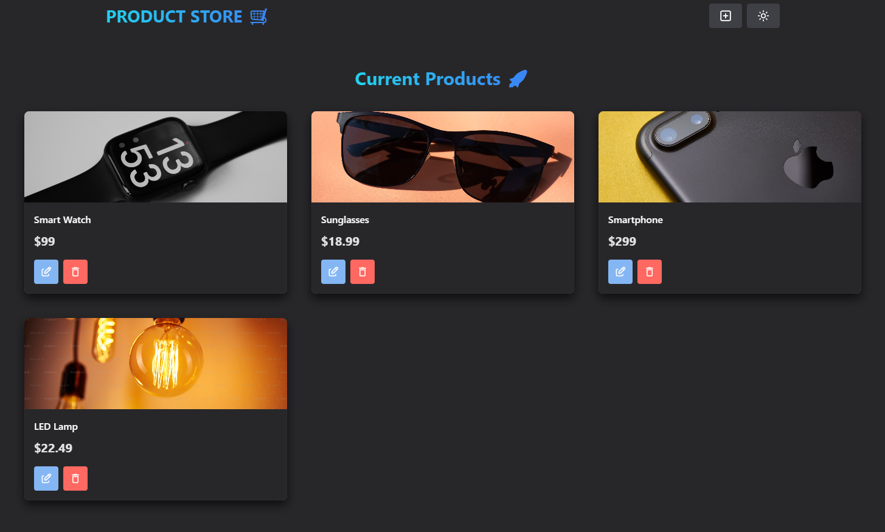

# Product Store 🛒✨



## 📌 Table of Contents

- [Product Store 🛒✨](#product-store-)
  - [📌 Table of Contents](#-table-of-contents)
  - [🌐 Overview](#-overview)
  - [⚙️ Features](#️-features)
  - [💻 Technologies Used](#-technologies-used)
  - [🗝️ Key Takeaways](#️-key-takeaways)
  - [🚀 How to Run the Project](#-how-to-run-the-project)
  - [🤝 Contributing](#-contributing)
  - [💬 Contact](#-contact)

## 🌐 Overview

Product Store is a full-stack MERN application for managing products. Users can create, view, update, and delete products. The front-end is built with React, Chakra UI, and Zustand for state management. The back-end uses Express, MongoDB, and includes security features like rate limiting and XSS protection. The project ensures a smooth user experience with a responsive design and modern features.

## ⚙️ Features

- **CRUD Operations**: Create, Read, Update, and Delete products.
- **Product Management**: Each product has a name, price, and image.
- **API Integration**: The front-end communicates with an Express API to fetch and manage product data.
- **User-Friendly Interface**: A responsive interface for both desktop and mobile users.
- **Authentication (Future feature)**: Login and authentication support can be added later.
- **Security**: Includes rate limiting, helmet for HTTP headers, and XSS protection.

## 💻 Technologies Used

- [React](https://reactjs.org/): JavaScript library for building user interfaces.
- [Chakra UI](https://chakra-ui.com/): A component library for React to build responsive UIs with ease.
- [Express](https://expressjs.com/): Node.js web framework for handling HTTP requests.
- [MongoDB](https://www.mongodb.com/): NoSQL database for storing product information.
- [Mongoose](https://mongoosejs.com/): MongoDB object modeling tool.
- [Zustand](https://github.com/pmndrs/zustand): A minimal state management solution for React.
- [Helmet](https://helmetjs.github.io/): Middleware for securing Express apps by setting HTTP headers.
- [Cors](https://www.npmjs.com/package/cors): Middleware to enable Cross-Origin Request Sharing.
- [Rate Limiter](https://www.npmjs.com/package/express-rate-limit): Limits repeated requests to public APIs.
- [React Router](https://reactrouter.com/): Declarative routing for React.
- [XSS Sanitizer](https://www.npmjs.com/package/xss): Middleware to prevent XSS attacks.

## 🗝️ Key Takeaways

1. **Full-Stack Development**: Integrating React with Express and MongoDB for a complete product management system.
2. **State Management**: Utilizing Zustand to efficiently manage and share state across components.
3. **Security Best Practices**: Implementing helmet for security headers and rate limiting for API protection.
4. **Responsive Design**: Ensuring the UI works well on both desktop and mobile devices using Chakra UI.
5. **CRUD Functionality**: Allowing users to manage products through a simple interface and API endpoints.

## 🚀 How to Run the Project

After cloning, downloading, or forking, follow these steps:

1. **Install dependencies**:
    ```bash
    npm install
    ```

2. **Set up environment variables**:
    - Create a `.env` file in the root directory and add the following variables:
      ```
      PORT=3000
      MONGO_URI=your_mongodb_connection_string
      NODE_ENV=development
      ```

3. **Run the development server**:
    ```bash
    npm run dev
    ```
   This will run the server in development mode, automatically opening the app in your browser and enabling hot reloading for front-end changes.

4. **Build the app for production**:
    ```bash
    npm run build
    ```
   This command compiles and optimizes the app for production, creating the necessary static files in the `dist` folder.

5. **Start the production server**:
    ```bash
    npm run start
    ```
   This will start the server in production mode, serving the optimized build files. Make sure to run `npm run build` before using `npm run start`.

## 🤝 Contributing

Contributions are welcome! Feel free to open issues or pull requests for any improvements or bug fixes.

## 💬 Contact 

For any inquiries or collaboration opportunities, feel free to reach out via:

[](mailto:cauebrolesef@gmail.com)
[](https://www.linkedin.com/in/cauebrolesef/)
[](https://www.instagram.com/cauebf_/)
[](https://github.com/Cauebf)

<p align="right">(<a href="#product-store-">back to top</a>)</p>
